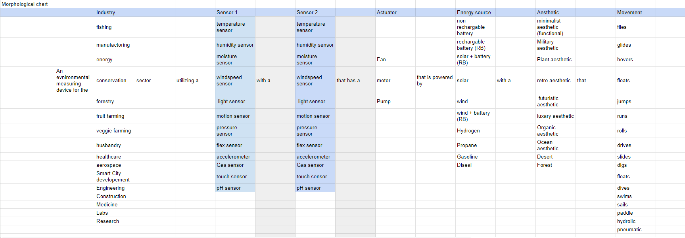
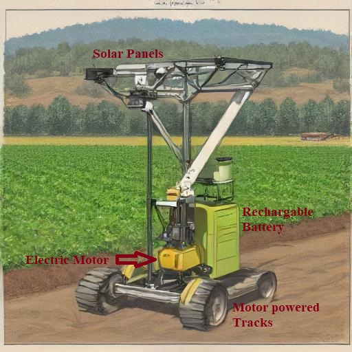
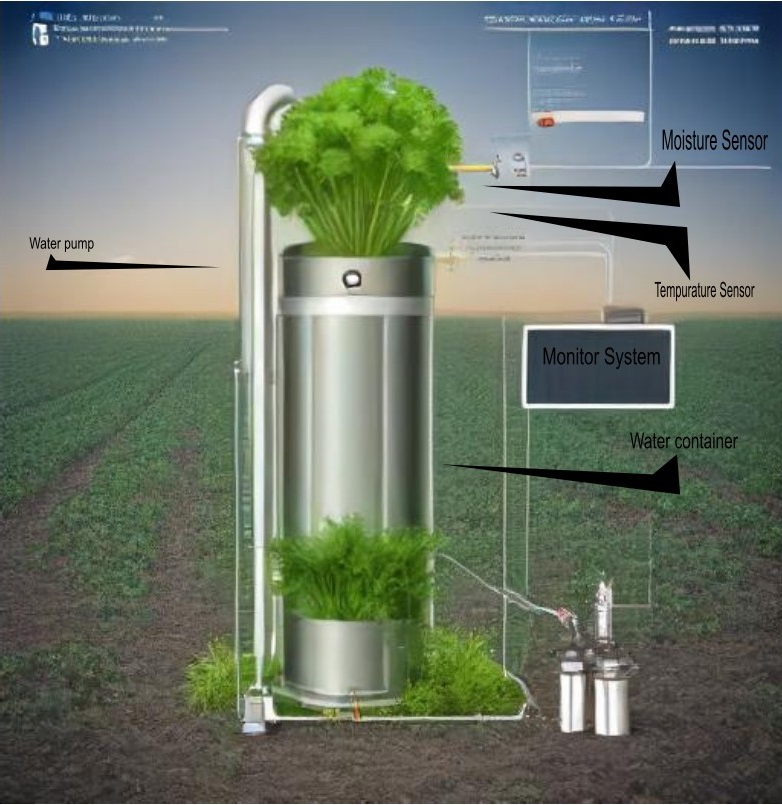

For our design ideation, each member started by creating ideas they thought would be cool for a project. However, this did not lead to very many results. After this initial session, we switched to a more systematic approach using a morphological chart generating an enormous amount of possible solutions (65! / 11!12!11!1!7!8!16!).The chart can be seen below

With such a plethora of options, our team decided to start getting specifc about what ideas we wanted to pursue.

We judged, it primarily by our user needs and what we found as viable within our skill level and time deadliness. Due to our morphological chart, it did generate a prompt that we could theoretically use in an AI software to give us a rapid prototype image for our proposed project. And our team pursued that option, giving us the following designs: 

**Design 1. A Micro Greenhouse** 

Morphological generated prompt: *A micro greenhouse blueprint for the conservation sector moisture sensor with a humidity sensor that has a motor that is powered by rechargeable battery with a plant aesthetic that rotates.*

The moisture sensor would track soil moisture levels to ensure the plants inside gets enough water, while the humidity sensor would monitor the air moisture to keep the environment optimal for plant growth. Data from these sensors could trigger alerts or automatic adjustments like turning on a small fan or adding water. The micro greenhouse could also have a small display or interface to show real-time data on moisture and humidity levels.

**Design 2. An Agricultural Monitoring robot**

Morphological generated prompt: *An environmental measuring device for the fruit farming sector that utilizes a temp and moisture sensor, that has a motor powered by a solar rechargeable battery with a minimalist aesthetic that drives.*

The temperature sensor would monitor the ambient air temperature while the moisture sensor tracks soil moisture levels. The data would help farmers make informed decisions about the required irrigation and crop management. The solar-powered battery would ensure continuous operation without needing frequent recharging, making it highly efficient for large scale farming.

 
**Design 3 An Automated Watering Pump**

Morphological generated prompt: *An environmental measuring device for the veggie farming sector that utilizes a temp and humidity sensor, that has a pump powered by solar and rechargeable battery with a minimalist aesthetic.*

The temp sensor would track air temperature ensuring that the crops remain within the ideal temperature ranges for growth. The humidity sensor would help manage air moisture which is crucial for many vegetable crops. The pump would be activated to irrigate the crops or to mist the air if humidity levels drop too low.

**Our Selected Design: The Micro-Greenhouse**

For the focus of our project. Our team decided to pick the Micro-Greenhouse. We found that it was the best design within the skill level of our team and matched the vast majority of all our passive, active and cosmetic user needs. It also was a device that allowed the greatest flexibility for potential upgrades and blends of other ideas. For instance, Design 3 was a very attractive option for our team, but we found that a watering pump could be easily added to  Design 1 if deadlines allowed, making a more comprehensive and capable design. Such would not be the case the other way around if we chose to start with design 3. Overall, these factors lead to Design 1 as our teams pursuit.   
